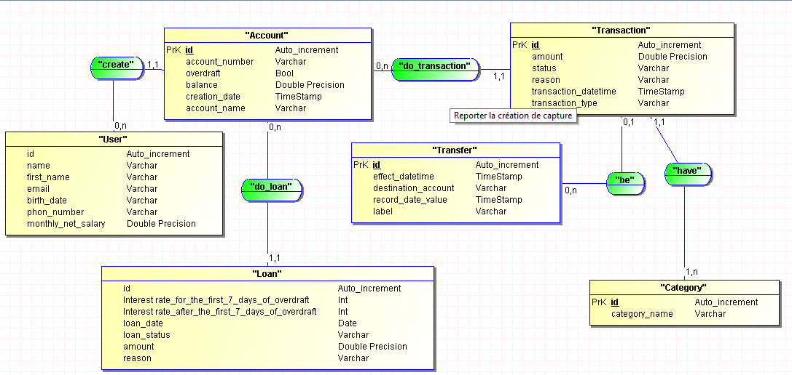

# <p align="center"> NEX GEN BANK</p>

<p align="center"> 
    This application is the backend of a virtual bank NexGenBank 
</p>

## MCD:

<p align="center">
  
</p>

## Technologies Used

- Back-End: Spring Boot, Java 2
- Database: PostgreSQL
- Front-End: [...]

## Installation

1. Clone this repository to your machine.

```sh
git clone https://github.com/NexGenBank/NexGenBank-back.git
cd NexGenBank-back
```

## Prerequisites

- Java 21
- Maven [OPTIONAL - Depending on the build tool you're using]
- PostgreSQL 16
- JDBC DRIVER

## SQL CONFIGURATION:

DATABASE NAME: "nexgenbank"
_____

- METHOD ONE:

> Directly run this file in your sql sheel: [sqlRun](src/main/resources/sqlRun.sql)

- VIA FLYWAY MIGRATION METHOD:

> Create dadabase first:
> >CREATE DATABASE IF NOT EXISTS nexgenbank;
>
> Customize this connection  information and execute the command in your maven terminal
> 
> >mvn flyway:migrate -Dflyway.url=jdbc:postgresql://localhost:5432/nexgenbank -Dflyway.user=your_username -Dflyway.password=your_password -Dflyway.baselineOnMigrate=true -Dflyway.cleanDisabled=true
> 
> ex:
> 
> > mvn flyway:migrate -Dflyway.url=jdbc:postgresql://localhost:5432/nexgenbank -Dflyway.user=postgres -Dflyway.password=12345678 -Dflyway.baselineOnMigrate=true -Dflyway.cleanDisabled=true

## OpenAPI-Explorer:

You can see directly the openApi of this project
from [swagger UI](https://petstore.swagger.io/?url=https://gist.githubusercontent.com/Tiana-Finaritra/ea2f605bd57a27e27b17c4232ed45763/raw/05f8f2ff5679de8e97849b27a13492848756e49e/openAPI-MadaTrans.yaml)

## Liscence:

Prog4 - HEI ✔